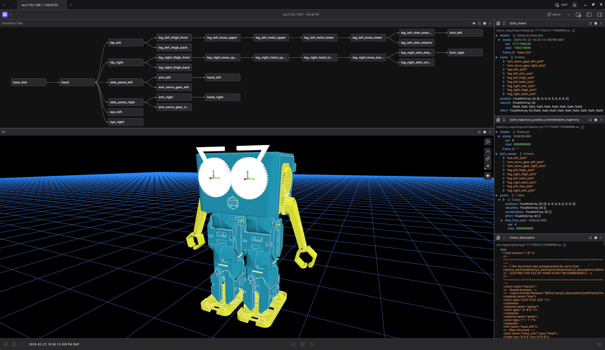
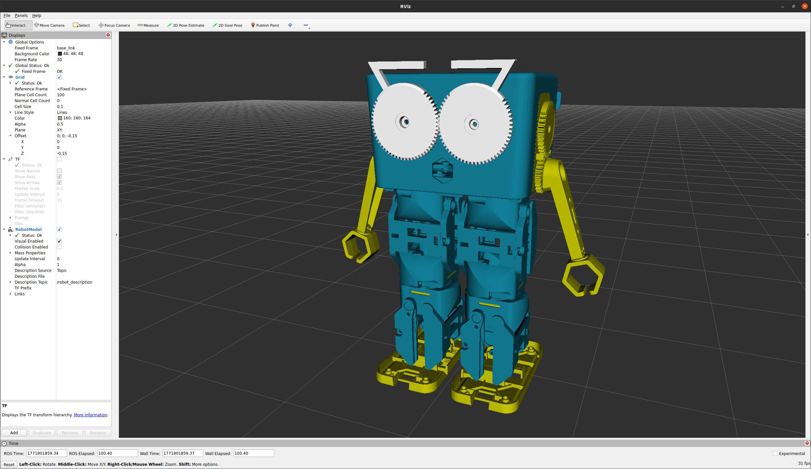

# marty2_description
Marty v2 description including the URDF and mesh files for the Marty robot v2 (Robotical)






## Usage

This repository is designed to be used alongside a Docker container. Quickly build and run the Docker container using `runtime.sh` for runtime or debugging, and `dev.sh` for a convenient development setup.

### Runtime or Debugging

Execute the ROS 2 nodes in runtime mode or start an interactive bash session for detailed debugging:

```bash
./runtime.sh [bash]
```

- **Without arguments**: Activates the container in runtime mode.
- **With `bash`**: Opens an interactive bash session for debugging.

### Development

Prepare a development setting that reflects local code modifications and simplifies the build process:

```bash
./dev.sh
```

- **Live Code Synchronization**: Mounts local directories with the container.
- **Convenience Alias**: The development container features a `colcon_build` alias, which simplifies the ROS2 build process. Executing `colcon_build` runs `colcon build --symlink-install --cmake-args -DCMAKE_BUILD_TYPE=Release` and then sources the `setup.bash` to ensure the environment is updated with the latest build artifacts. This alias enhances productivity by combining build commands and environment setup into a single, easy command.
